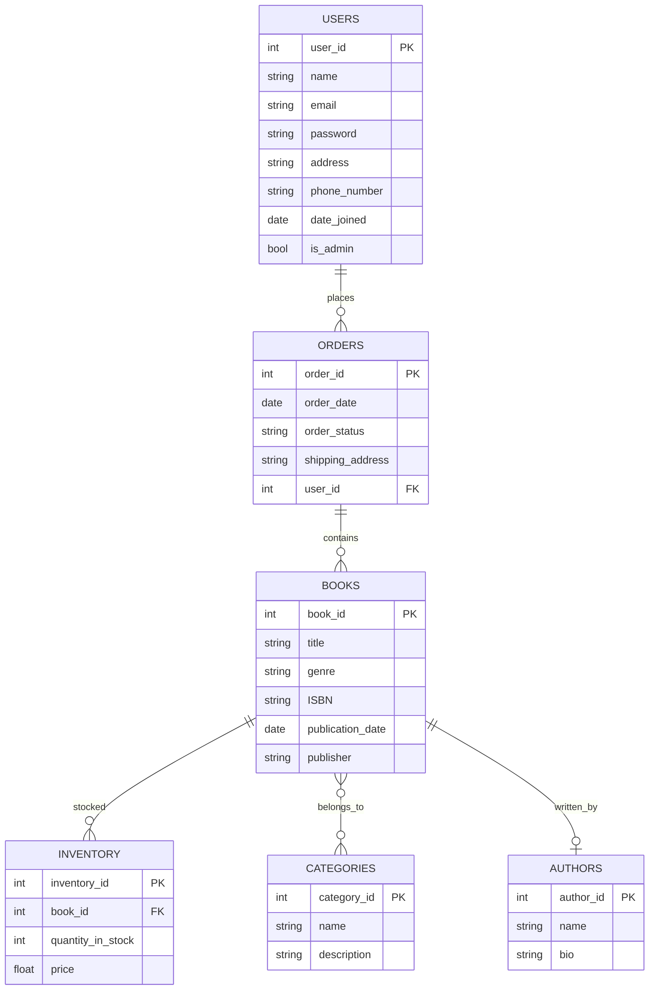

# database diagram

```mermaid
erDiagram
    USERS ||--o{ ORDERS : places
    USERS {
        int user_id PK
        string name
        string email
        string password
        string address
        string phone_number
        date date_joined
        bool is_admin
    }
    ORDERS ||--o{ BOOKS : contains
    ORDERS {
        int order_id PK
        date order_date
        string order_status
        string shipping_address
        int user_id FK
    }
    BOOKS ||--o{ INVENTORY : stocked
    BOOKS }o--o{ CATEGORIES : belongs_to
    BOOKS ||--o| AUTHORS : written_by
    BOOKS {
        int book_id PK
        string title
        string genre
        string ISBN
        date publication_date
        string publisher
    }
    INVENTORY {
        int inventory_id PK
        int book_id FK
        int quantity_in_stock
        float price
    }
    CATEGORIES {
        int category_id PK
        string name
        string description
    }
    AUTHORS {
        int author_id PK
        string name
        string bio
    }
```
