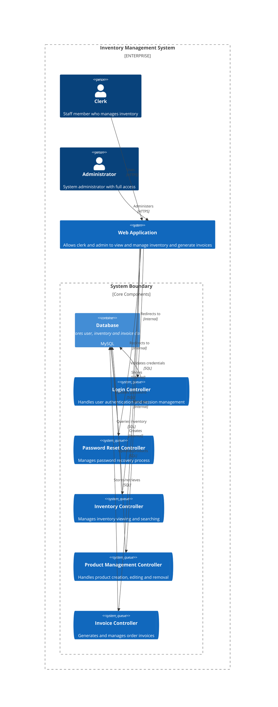

# C4 Component Diagram

```mermaid


C4Component
    Enterprise_Boundary(b0, "Inventory Management System") {
        Person(clerk, "Clerk", "Staff member who manages inventory")
        Person(admin, "Administrator", "System administrator with full access")
        
        System(SystemAA, "Web Application", "Allows clerk and admin to view and manage inventory and generate invoices")
        
        Boundary(b3, "System Boundary", "Core Components") {
            Container(db, "Database", "Stores user, inventory and invoice data", "MySQL")
            
            SystemQueue(SystemLogin, "Login Controller", "Handles user authentication and session management")
            SystemQueue(SystemPassReset, "Password Reset Controller", "Manages password recovery process")
            SystemQueue(SystemInventoryPage, "Inventory Controller", "Manages inventory viewing and searching")
            SystemQueue(SystemEditInventory, "Product Management Controller", "Handles product creation, editing and removal")
            SystemQueue(InvoiceGenerate, "Invoice Controller", "Generates and manages order invoices")

            Rel(clerk, SystemAA, "Uses", "HTTPS")
            Rel(admin, SystemAA, "Administers", "HTTPS")
            
            Rel(SystemAA, SystemLogin, "Redirects to", "Internal")
            Rel(SystemLogin, db, "Validates credentials", "SQL")
            
            Rel(SystemAA, SystemPassReset, "Redirects to", "Internal")
            Rel(SystemPassReset, db, "Updates password", "SQL")
            
            Rel(SystemAA, SystemInventoryPage, "Shows", "Internal")
            Rel(SystemInventoryPage, db, "Queries inventory", "SQL")
            
            Rel(SystemAA, SystemEditInventory, "Manages", "Internal")
            Rel(SystemEditInventory, db, "Updates products", "SQL")
            
            Rel(SystemAA, InvoiceGenerate, "Creates", "Internal")
            Rel(InvoiceGenerate, db, "Stores/retrieves", "SQL")
        }
    }
```
