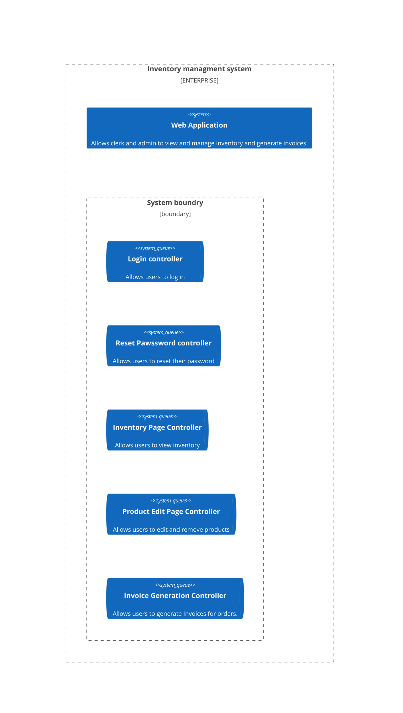

# C4 Component Diagram

```mermaid


C4Component
Enterprise_Boundary(b0, "Inventory managment system") {
        System(SystemAA, "Web Application", "Allows clerk and admin to view and manage inventory and generate invoices.")
          Boundary(b3, "System boundry", "boundary") {
            SystemQueue(SystemLogin, "Login controller", "Allows users to log in")
            SystemQueue(SystemPassReset, "Reset Pawssword controller", "Allows users to reset their password")
            SystemQueue(SystemInventoryPage, "Inventory Page Controller", "Allows users to view inventory")
            SystemQueue(SystemEditInventory, "Product Edit Page Controller", "Allows users to edit and remove products",)
            SystemQueue(InvoiceGenerate, "Invoice Generation Controller", "Allows users to generate Invoices for orders.")
          }
      }
```
