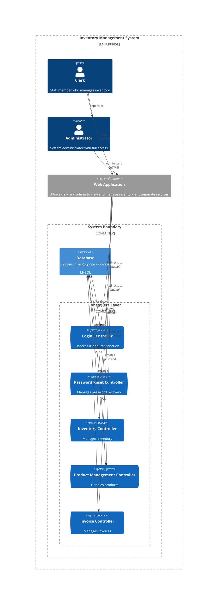

# C4 Component Diagram

```mermaid


C4Component
    Enterprise_Boundary(b0, "Inventory Management System") {
        Person(clerk, "Clerk", "Staff member who manages inventory")
        Person(admin, "Administrator", "System administrator with full access")
        
        Rel_U(clerk, admin, "Reports to")
        
        System_Ext(SystemAA, "Web Application", "Allows clerk and admin to view and manage inventory and generate invoices")
        
        Rel_D(clerk, SystemAA, "Uses", "HTTPS")
        Rel_D(admin, SystemAA, "Administers", "HTTPS")
        
        Container_Boundary(b3, "System Boundary", "Core Components") {
            Container(db, "Database", "Stores user, inventory and invoice data", "MySQL")
            
            Container_Boundary(controllers, "Controllers Layer") {
                SystemQueue(SystemLogin, "Login Controller", "Handles user authentication")
                SystemQueue(SystemPassReset, "Password Reset Controller", "Manages password recovery")
                SystemQueue(SystemInventoryPage, "Inventory Controller", "Manages inventory")
                SystemQueue(SystemEditInventory, "Product Management Controller", "Handles products")
                SystemQueue(InvoiceGenerate, "Invoice Controller", "Manages invoices")
            }
            
            Rel_R(SystemAA, SystemLogin, "Redirects to", "Internal")
            Rel_R(SystemAA, SystemPassReset, "Redirects to", "Internal")
            Rel_R(SystemAA, SystemInventoryPage, "Shows", "Internal")
            Rel_R(SystemAA, SystemEditInventory, "Manages", "Internal")
            Rel_R(SystemAA, InvoiceGenerate, "Creates", "Internal")
            
            Rel_D(SystemLogin, db, "Validates", "SQL")
            Rel_D(SystemPassReset, db, "Updates", "SQL")
            Rel_D(SystemInventoryPage, db, "Queries", "SQL")
            Rel_D(SystemEditInventory, db, "Updates", "SQL")
            Rel_D(InvoiceGenerate, db, "Stores/retrieves", "SQL")
        }
    }
```
