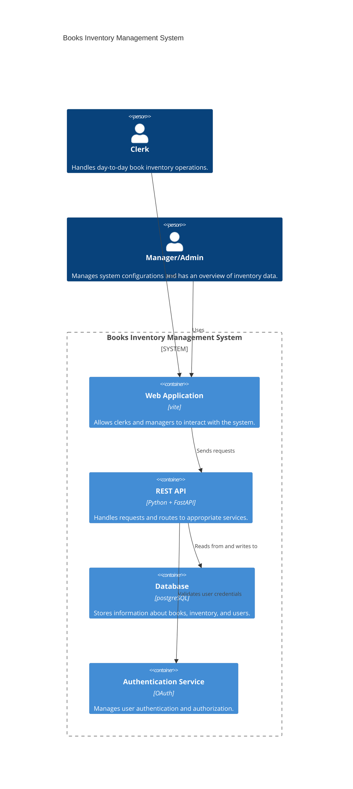

```mermaid
C4Container
    title Books Inventory Management System

    Person(clerk, "Clerk", "Handles day-to-day book inventory operations.")
    Person(manager, "Manager/Admin", "Manages system configurations and has an overview of inventory data.")

    System_Boundary(boundary, "Books Inventory Management System") {
        Container(webApp, "Web Application", "vite", "Allows clerks and managers to interact with the system.")
        Container(api, "REST API", "Python + FastAPI", "Handles requests and routes to appropriate services.")
        Container(db, "Database", "postgreSQL", "Stores information about books, inventory, and users.")
        Container(authService, "Authentication Service", "OAuth", "Manages user authentication and authorization.")
    }


    Rel_D(clerk, webApp, "Uses")
    Rel_D(manager, webApp, "Uses")
    Rel_D(webApp, api, "Sends requests")
    Rel_D(api, db, "Reads from and writes to")
    Rel_D(api, authService, "Validates user credentials")
```
