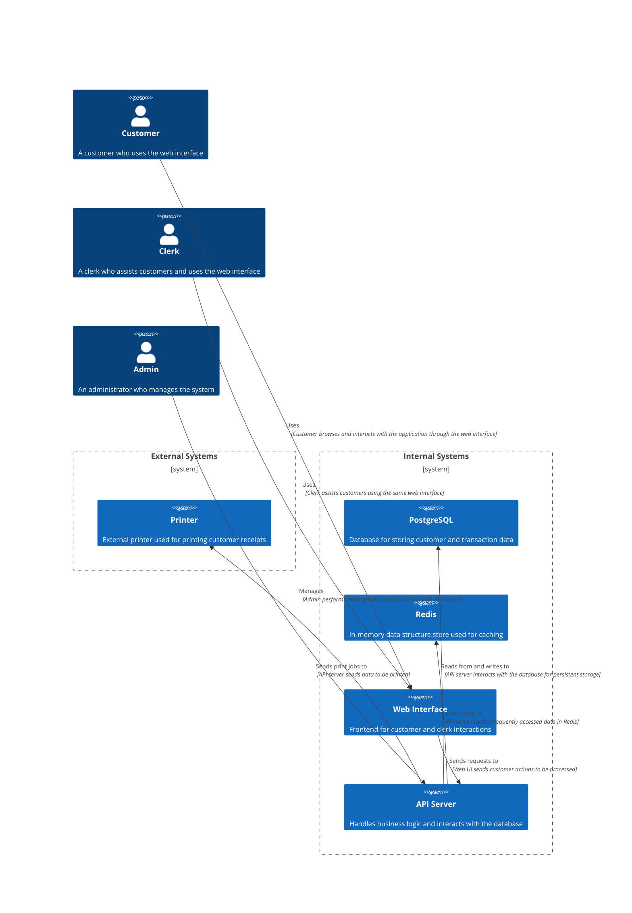

# C4 Context Diagram

```mermaid
C4Context

    %% Define people
    Person(customer, "Customer", "A customer who uses the web interface")
    Person(clerk, "Clerk", "A clerk who assists customers and uses the web interface")
    Person(admin, "Admin", "An administrator who manages the system")

    %% External systems
    Boundary(external, "External Systems") {
        System(Printer, "Printer", "External printer used for printing customer receipts")
    }

    %% Internal systems
    Boundary(internal, "Internal Systems") {
        System(Postgres, "PostgreSQL", "Database for storing customer and transaction data")
        System(Redis, "Redis", "In-memory data structure store used for caching")
        System(WebUI, "Web Interface", "Frontend for customer and clerk interactions")
        System(APIserver, "API Server", "Handles business logic and interacts with the database")
    }

    %% Relations between components
    Rel_L(customer, WebUI, "Uses", "Customer browses and interacts with the application through the web interface")
    Rel_L(clerk, WebUI, "Uses", "Clerk assists customers using the same web interface")
    Rel_R(admin, APIserver, "Manages", "Admin performs management operations through API server")
    Rel_D(WebUI, APIserver, "Sends requests to", "Web UI sends customer actions to be processed")
    Rel_D(APIserver, Postgres, "Reads from and writes to", "API server interacts with the database for persistent storage")
    Rel_D(APIserver, Redis, "Caches data in", "API server caches frequently accessed data in Redis")
    Rel_D(APIserver, Printer, "Sends print jobs to", "API server sends data to be printed")
```
