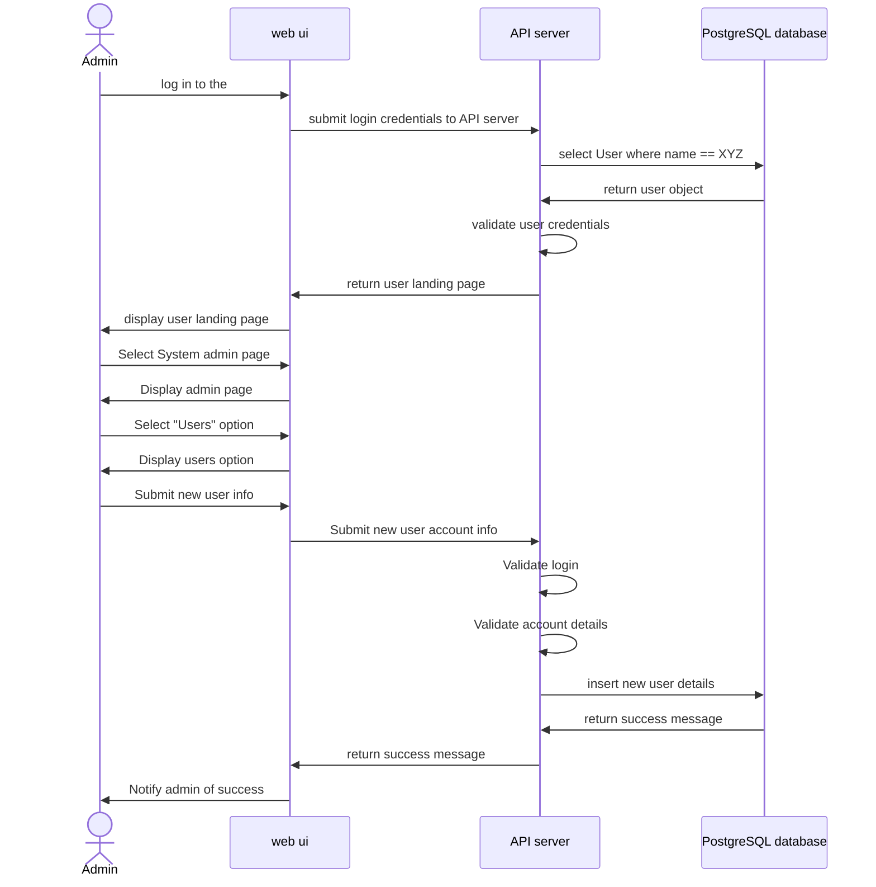
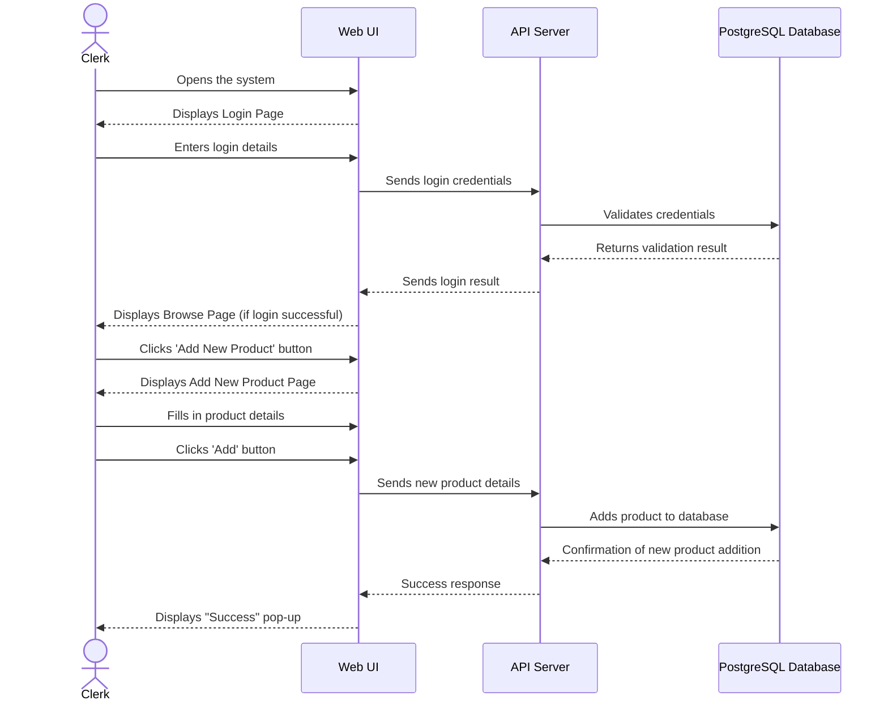
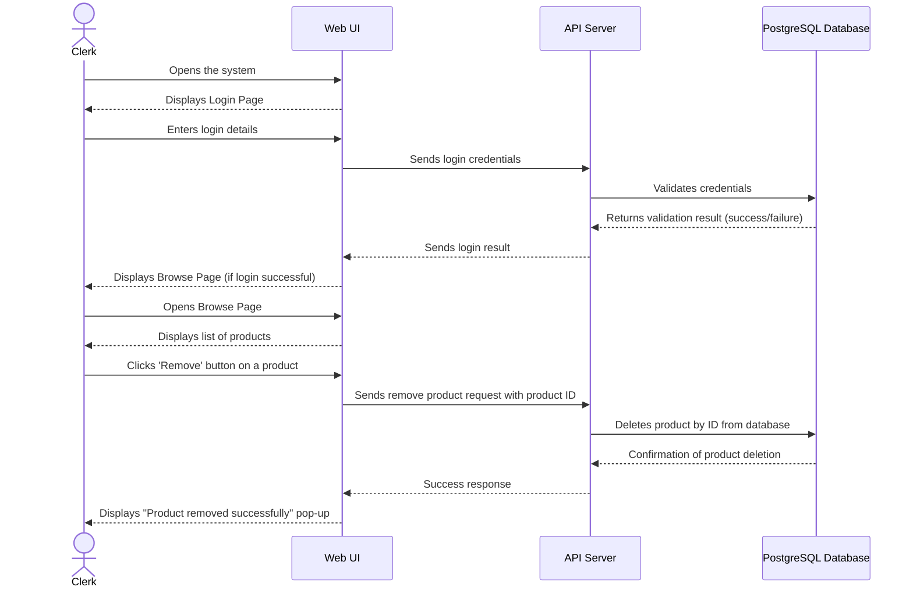

# Sequence Diagrams

## Add new clerk account

```mermaid
sequenceDiagram
    actor Admin
    participant ui as web ui
    participant API as API server
    participant rdb as PostgreSQL database

    Admin   ->> ui      : log in to the
    ui      ->> API     : submit login credentials to API server
    API     ->> rdb     : select User where name == XYZ
    rdb     ->> API     : return user object
    API     ->> API     : validate user credentials
    API     ->> ui      : return user landing page
    ui      ->> Admin   : display user landing page
    Admin   ->> ui      : Select System admin page
    ui      ->> Admin   : Display admin page
    Admin   ->> ui      : Select "Users" option
    ui      ->> Admin   : Display users option
    Admin   ->> ui      : Submit new user info
    ui      ->> API     : Submit new user account info
    API     ->> API     : Validate login
    API     ->> API     : Validate account details
    API     ->> rdb     : insert new user details
    rdb     ->> API     : return success message
    API     ->> ui      : return success message
    ui      ->> Admin   : Notify admin of success
```

## Add new product

```mermaid
sequenceDiagram
    actor Clerk
    participant ui as Web UI
    participant API as API Server
    participant rdb as PostgreSQL Database

    Clerk ->> ui: Opens the system
    ui -->> Clerk: Displays Login Page

    Clerk ->> ui: Enters login details
    ui ->> API: Sends login credentials
    API ->> rdb: Validates credentials
    rdb -->> API: Returns validation result
    API -->> ui: Sends login result
    ui -->> Clerk: Displays Browse Page (if login successful)

    Clerk ->> ui: Clicks 'Add New Product' button
    ui -->> Clerk: Displays Add New Product Page

    Clerk ->> ui: Fills in product details
    Clerk ->> ui: Clicks 'Add' button
    ui ->> API: Sends new product details
    API ->> rdb: Adds product to database
    rdb -->> API: Confirmation of new product addition
    API -->> ui: Success response
    ui -->> Clerk: Displays "Success" pop-up
```

## Remove a product

```mermaid
sequenceDiagram
    actor Clerk
    participant ui as Web UI
    participant API as API Server
    participant rdb as PostgreSQL Database

    Clerk ->> ui: Opens the system
    ui -->> Clerk: Displays Login Page

    Clerk ->> ui: Enters login details
    ui ->> API: Sends login credentials
    API ->> rdb: Validates credentials
    rdb -->> API: Returns validation result (success/failure)
    API -->> ui: Sends login result
    ui -->> Clerk: Displays Browse Page (if login successful)

    Clerk ->> ui: Opens Browse Page
    ui -->> Clerk: Displays list of products

    Clerk ->> ui: Clicks 'Remove' button on a product
    ui ->> API: Sends remove product request with product ID
    API ->> rdb: Deletes product by ID from database
    rdb -->> API: Confirmation of product deletion
    API -->> ui: Success response
    ui -->> Clerk: Displays "Product removed successfully" pop-up
```
