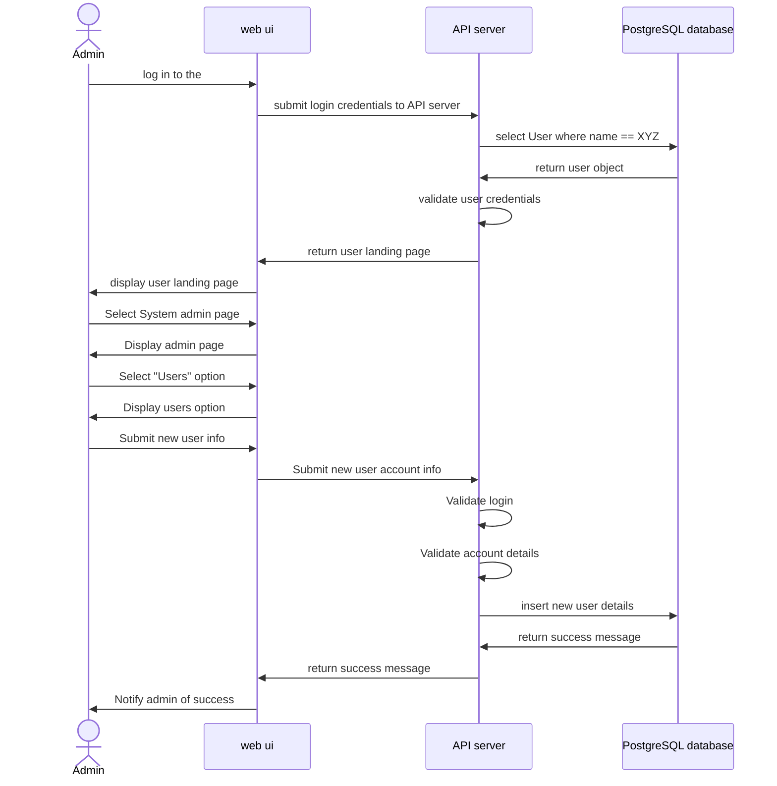

# Sequence Diagrams

## Add new clerk account

```mermaid
sequenceDiagram
    actor Admin
    participant ui as web ui
    participant API as API server
    participant rdb as PostgreSQL database

    Admin   ->> ui      : log in to the
    ui      ->> API     : submit login credentials to API server
    API     ->> rdb     : select User where name == XYZ
    rdb     ->> API     : return user object
    API     ->> API     : validate user credentials
    API     ->> ui      : return user landing page
    ui      ->> Admin   : display user landing page
    Admin   ->> ui      : Select System admin page
    ui      ->> Admin   : Display admin page
    Admin   ->> ui      : Select "Users" option
    ui      ->> Admin   : Display users option
    Admin   ->> ui      : Submit new user info
    ui      ->> API     : Submit new user account info
    API     ->> API     : Validate login
    API     ->> API     : Validate account details
    API     ->> rdb     : insert new user details
    rdb     ->> API     : return success message
    API     ->> ui      : return success message
    ui      ->> Admin   : Notify admin of success
```